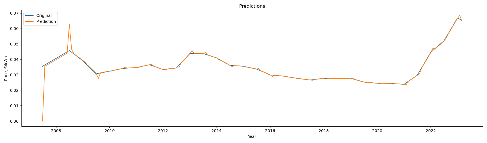

# Natural Gas Price Prediction in Germany for 2025-2026
## Timeseries Analysis

### Objective

Develop a predictive model to forecast non-household natural gas prices in Germany. Utilize historical price data and relevant explanatory variables to create a model that accurately anticipates future price trends.

--------------------------------------------------

### Methodology
#### 1. Data Preparation

- Dataset: Utilize historical non-household natural gas price data for Germany spanning from 01-07-2007 to 01-07-2023.
- Exploratory Data Analysis (EDA): Conduct a thorough EDA to understand the data characteristics, identify patterns, and assess data quality.
- Stationarity, Trends, and Seasonality: Analyze the time series for stationarity, trends, and seasonality. If necessary, apply appropriate transformations (e.g., differencing, log transformations) to achieve stationarity.

#### 2. Model Development and Evaluation

- ARIMA: Fit an ARIMA model to capture autoregressive, integrated, and moving average components within the time series.
- SARIMAX: Employ a SARIMAX model to incorporate seasonal patterns in addition to the ARIMA components.
- Facebook Prophet: Utilize Facebook Prophet, a time series forecasting library designed for handling trends, seasonality, and holidays.

#### 3. Model Comparison and Selection

- Evaluation Metrics: Employ appropriate metrics (Root Mean Squared Error (RMSE)) to assess the accuracy and performance of each model.
- Model Selection: Choose the best-fit model based on its performance metrics, interpretability, and computational efficiency. Consider the trade-off between model complexity and accuracy.

#### 4. Forecasting
------------------------------------------------------

### Results

Among the three models evaluated, the SARIMAX model demonstrated the lowest Root Mean Squared Error (RMSE). This indicates that the SARIMAX model provides the most accurate forecasts of non-household natural gas prices in Germany based on the given dataset.

